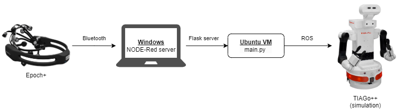

# EmotivBCI-Controlled-Robot

Welcome to my EmotivBCI-Controlled-Robot project!

This project focuses on developing a BCI-controlled robotic assistant using the TIAGo++ robot parallel gripper from PAL Robotics and Emotiv's Epoch+ headset for object grasping tasks. By leveraging Emotiv's Epoch+ headset, I aim to enable intuitive control of robotic grasping through mental commands, enhancing accessibility and efficiency in assistive robotics.

## Overview

- [Introduction](docs/USAGE.md): Learn about the project and its objectives.
- [Installation Guide](docs/INSTALLATION.md): Follow detailed instructions for setting up the development environment, including ROS, Node-RED, and other dependencies.
- [Troubleshooting](docs/TROUBLESHOOTING.md): Get help with common issues and solutions.
- [References](docs/REFERENCES.md): Find additional resources and documentation.

## Project Structure

- `mind_control/`: Contains the source code for controlling the TIAGo++ robot.
- `flows.json`: Node-RED flow configuration file.

  

## Getting Started

To get started, follow the [Installation Guide](docs/INSTALLATION.md) to set up your environment. Once installed, you can refer to the [Usage Guide](docs/USAGE.md) for instructions on running the project and controlling the robot.

If you encounter any issues, consult the [Troubleshooting](docs/TROUBLESHOOTING.md) guide or open an issue in this repository.

## License

This project is licensed under the MIT License. <!-- See the [LICENSE](LICENSE) file for more details. -->

## Contact

For any questions or support, please reach out to [my email](mailto:rp2073@hw.ac.uk).
