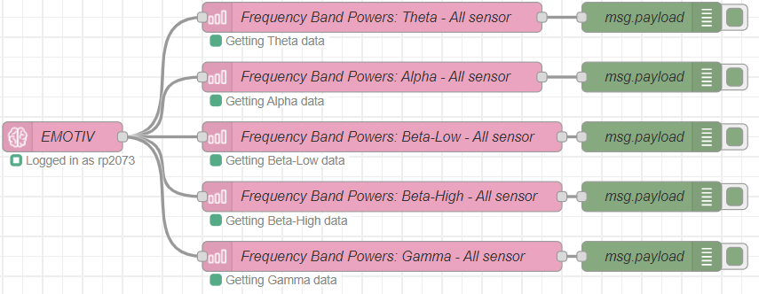
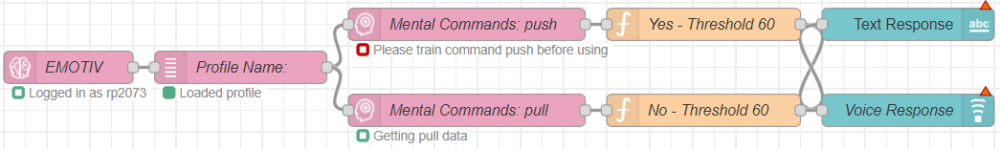
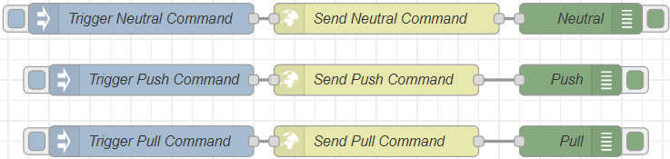
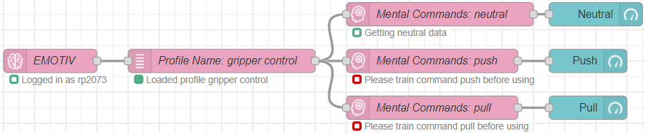

# Explanation

## Emotiv BCI to ROS Flow

This Node-RED flow integrates the Emotiv Brain-Computer Interface (BCI) with the Robot Operating System (ROS). Here's a breakdown of the components and their functions:

1. Emotiv Headset and Profile Connection

  - EMOTIV Node: Connects to the Emotiv headset and logs in with the user profile.

  - Profile: gripper control: Loads the profile for controlling the gripper.

2. Commands Test

  - Close gripper and Open gripper nodes: These nodes send commands to close and open the gripper, respectively.

3. Mental Commands

  - MC: neutral, push, pull nodes: These nodes capture mental commands from the Emotiv headset. Users need to train these commands before using them.
  
  - Neutral msg, Push msg, Pull msg function nodes: These nodes process the mental commands and generate corresponding messages.

4. Flask Server

  - Send Neutral Command, Send Push Command, Send Pull Command nodes: These nodes send the processed mental command messages to the Flask server.

5. Motion Sensors

  MS: Acceleration X, Y, Z nodes: These nodes capture acceleration data along the X, Y, and Z axes from the Emotiv headset.

6. Motion Sensors Processing

    Send accX, Send accY, Send accZ nodes: These nodes send the processed acceleration data messages.

7. Dashboard

  - Neutral, Push: close gripper, Pull: open gripper nodes: These nodes display the status of the neutral, push, and pull commands on the Node-RED dashboard.

  - Tilt node: This node processes tilt data.

  - Head tilt and value nodes: These nodes display the head tilt data on the dashboard.

## Other flows for testing

  
    
  
    
  
    
  

These flows are just used to test the connection between all the project's components.
