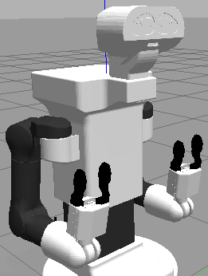
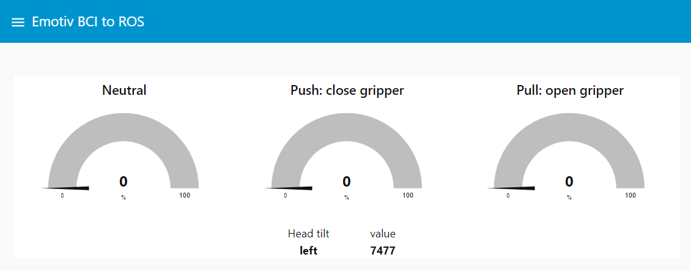

# Usage Guide

# Introduction

This project involves the setup, simulation, and control of the TIAGo++ robot using ROS (Robot Operating System). The TIAGo++ is a versatile mobile manipulator designed by PAL Robotics, suitable for research and industrial applications. This README will guide you through the installation of Ubuntu, ROS Noetic, and the TIAGo++ simulation environment. It also includes instructions for operating the grippers and launching simulations.

## Overview

- [README](../README.md): Read the project's presentation
- [Installation Guide](docs/INSTALLATION.md): Follow detailed instructions for setting up the development environment, including ROS, Node-RED, and other dependencies.
- [Explanation](docs/EXPLANATION.md): Detail the functionnalities of the project
- [Troubleshooting](docs/TROUBLESHOOTING.md): Get help with common issues and solutions.
- [References](docs/REFERENCES.md): Find additional resources and documentation.

## Running the Project

To test the project, follow these steps:

1. Connect the Emotiv headset to your laptop.

2. Open an Ubuntu terminal and source the workspace:
   ```bash
   cd /tiago_dual_public_ws/
   source ./devel/setup.bash
   ```

3. Still in an Ubuntu terminal, launch:
   - the simulation:
     
      ```bash
      roslaunch tiago_dual_gazebo tiago_dual_gazebo.launch public_sim:=true end_effector_left:=pal-gripper end_effector_right:=pal-gripper
      ```

   - main program:
      ```bash
      python3 main.py
      ```
      
4. In a cmd terminal, launch NODE-Red flows:
   ```bash
   node-red
   ```

5. This flow enables the integration of mental commands from the Emotiv BCI with ROS, allowing for intuitive control of robotic components such as a gripper. The dashboard provides a visual representation of the commands and sensor data, facilitating monitoring and debugging. (The other flows are just for testing functionnalities).

   
   
